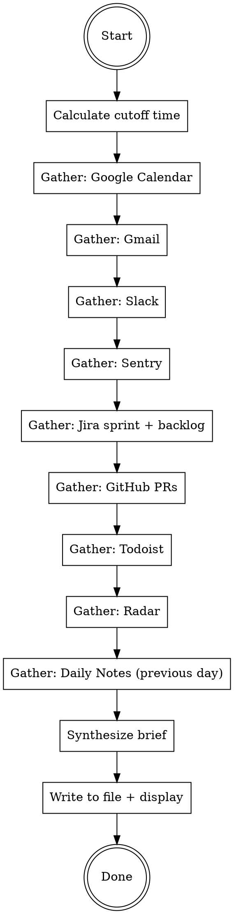

# Daily Brief

Generate Matt's morning briefing by gathering data from all sources, synthesizing priorities, and outputting a structured daily brief.

## Process



## Step 1: Calculate Cutoff Time

The cutoff is **5:00 PM previous workday, Pacific/Auckland timezone**.
- If today is Monday → cutoff is Friday 5:00 PM
- Otherwise → cutoff is yesterday 5:00 PM

Use this cutoff for all "since yesterday" queries.

## Step 2: Gather Data (Sequential)

Gather each source one at a time, in this order. Do NOT use subagents or parallel gathering.

### 2a. Google Calendar

Fetch today's events. For each event, capture: time, title, attendees, duration. Note which are sprint ceremonies (planning, standup, retro, refinement, guild) and which are 1:1s with direct reports.

### 2b. Gmail

Search for emails since the cutoff time. Surface emails needing a response — especially from stakeholders, the CEO (Tai), or external parties. Group by urgency.

### 2c. Slack

Search for messages and mentions since the cutoff time. Look for: direct mentions, DMs, messages in engineering/incident/alert channels, any unresolved questions or decision requests. Use `slack_search_public_and_private` to find mentions of Matt.

### 2d. Sentry

Search for new unresolved issues in project `sea-flux-frontend` since the cutoff time. **Ignore warnings** — only surface error and fatal level issues. Include event count and first/last seen times.

### 2e. Jira

Project key: **SF**

**Active sprint:** Search for all issues in the current open sprint using JQL: `project = SF AND sprint in openSprints() ORDER BY assignee, status`

Capture: summary, status, assignee, priority, and last updated date.

**Backlog:** Search for recently updated backlog items: `project = SF AND sprint not in openSprints() AND sprint is EMPTY AND updated >= "{cutoff_date}" ORDER BY updated DESC`

**Staleness flags:**
- Ticket in-progress for 3+ days without a linked PR → flag as stuck
- Ticket in-review for 2+ days → flag as stuck

### 2f. GitHub PRs

Repos: `sea-flux/sea-flux-native` and `sea-flux/sea-flux-firebase`

For each repo, run:
```bash
gh pr list --repo {repo} --state open --json number,title,author,createdAt,updatedAt,reviewDecision,additions,deletions,changedFiles,headRefName,isDraft,reviewRequests,statusCheckRollup,comments,url
```

**For EVERY open PR**, read the full comment/review chain:
```bash
gh api repos/{owner}/{repo}/pulls/{number}/comments
gh api repos/{owner}/{repo}/pulls/{number}/reviews
gh api repos/{owner}/{repo}/issues/{number}/comments
```

Flag discussions with 5+ comments, disagreements, or unresolved review threads.

**Tiered diff reading — deep-read a PR if ANY of these apply:**
- 10+ files changed or 500+ lines added/deleted
- 5+ review comments
- Touches sensitive areas: auth, payments, database migrations, security rules, CI/CD config, Firestore rules
- Has "changes requested" review that hasn't been addressed

**For deep-read PRs**, fetch the full diff:
```bash
gh pr diff {number} --repo {repo}
```

Then flag:
- Dangerous patterns (direct DB mutations, missing error handling, security concerns, N+1 queries, hardcoded secrets)
- Architectural concerns (tight coupling, wrong layer, bypassing established patterns)
- Scope creep (PR doing more than its ticket describes)

**For all PRs (skimmed and deep-read), surface:**
- Status: ready for review, changes requested, approved, draft
- Staleness: open 3+ days with no activity
- Missing reviewer: no reviewer assigned

### 2g. Todoist

Fetch tasks from Todoist that are due today or overdue. Also fetch any tasks updated since the cutoff time. Group by project if applicable. Surface anything due today or overdue as action items.

### 2h. Radar

Read `radar.md` from the brain repo root. This contains items on Matt's mind that haven't become full projects yet. Include these in the brief output as context — they may connect to other items surfaced in the brief.

### 2i. Daily Notes (Previous Day)

Read the previous workday's daily notes from `daily-notes/` in the brain repo. Files may be named `YYYY-MM-DD.md` or may use other naming conventions — look for any file matching the previous workday's date, or the most recent file if none matches exactly.

If found, produce a short summary of the notes and include an Obsidian link to the file: `[[daily-notes/YYYY-MM-DD]]`. This gives Matt continuity from yesterday's scratch thoughts into today's brief.

If no daily notes exist for the previous day, note "No daily notes from yesterday" and move on.

## Step 3: Build Team Status View

For each of Matt's 5 direct reports — **Joanna, Michael, Olly, Peter, Sreeman** — compile:
- What Jira tickets they're assigned to in the active sprint, and each ticket's status
- Any open PRs they have, and the state of those PRs
- Flag anything stuck per the staleness thresholds above

Present this as a per-person section so Matt can walk into any conversation knowing what that person is working on.

## Step 4: Synthesize and Output

Write the brief to `daily-briefs/YYYY-MM-DD.md` in the brain repo (create the directory if it doesn't exist), AND display the full brief in the terminal.

Use this exact output structure:

```markdown
# Daily Brief — YYYY-MM-DD

## Today's Agenda
[Chronological list of meetings/events with times, attendees, and context.
Flag sprint ceremonies and 1:1s with direct reports.]

## Action Items
[Top 3-5 highest priority things Matt should focus on today.
Synthesize from ALL sections below. This is the "30 seconds" section —
the most important part of the entire brief.]

## Overnight Activity

### Email
[Key emails needing attention, grouped by urgency]

### Slack
[Important messages/threads since cutoff]

### Sentry
[New errors/fatals with event count and impact]

## Sprint Status
[Sprint progress: X of Y points complete, Z days remaining.
Per-person breakdown for each of the 5 direct reports:
what they're working on, ticket status, any PRs open, what's stuck.
Stale tickets flagged.]

## Pull Requests
[PRs needing Matt's review — list first.
PRs with active discussions or concerns.
Stale PRs (3+ days no activity).
Deep-read findings: dangerous patterns, architectural concerns, scope creep.]

## Backlog
[Recently updated backlog items worth noting]

## Todoist
[Tasks due today or overdue. Group by project if applicable.]

## Radar
[Items from radar.md — things on Matt's mind not yet full projects.
Note any connections to items surfaced elsewhere in the brief.]

## Yesterday's Notes
[Summary of the previous workday's daily notes from daily-notes/.
Include an Obsidian link: [[daily-notes/YYYY-MM-DD]].
If no notes exist, state "No daily notes from yesterday."]
```

**The Action Items section is the most important part.** It must synthesize across ALL data sources to surface the highest-value, highest-ROI actions for today. Not a list of everything — a prioritized shortlist of what matters most.
